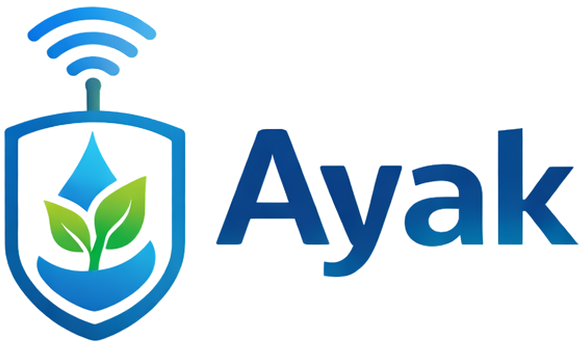

# 🌱 AYAK — IoT Smart Agriculture Cloud Website

<p align="center">
  
</p>

<p align="center">
  <strong>A cloud-hosted smart agriculture website showcasing IoT, LoRaWAN, and embedded-system technologies for modern farming applications.</strong>
</p>

<p align="center">
  
  
  
  
  
  
  
</p>

---

## 📌 Project Overview

**AYAK** is a smart agriculture IoT concept designed to demonstrate how connected sensors, LoRaWAN communication, embedded systems, and cloud technologies can support modern agricultural monitoring.

The website acts as the digital front page of the AYAK concept and presents:

- The project vision
- IoT hardware components
- LoRa / LoRaWAN communication technologies
- Soil-monitoring hardware
- Project team information
- Smart agriculture use cases
- Cloud deployment using **Amazon Web Services**

The frontend was developed using **HTML, CSS, and JavaScript**, with advanced animations powered by **GSAP** and **ScrollTrigger**.

The website was deployed as a static cloud application using **Amazon S3 Static Website Hosting**. The accompanying project report documents the AWS configuration, bucket permissions, deployment process, and cloud-security considerations.

---

# ✨ Key Features

## 🌾 Smart Agriculture Concept

AYAK presents a connected agriculture architecture based on:

- Soil monitoring
- Long-range wireless communication
- IoT field nodes
- LoRaWAN gateways
- Edge-capable microcontrollers
- Cloud-connected infrastructure

The project demonstrates how these technologies could be combined to support more efficient agricultural monitoring.

---

## 📡 IoT Hardware Showcase

The website includes an interactive hardware section featuring three major system components:

### 1. Heltec ESP32 LoRa V3

The project presents the **Heltec ESP32 LoRa V3** as the field-node microcontroller.

The website highlights capabilities such as:

- ESP32-S3 microcontroller
- Integrated LoRa communication
- Wireless connectivity
- OLED display
- Programmable GPIO
- Field sensor integration

---

### 2. DFRobot EU868 LoRaWAN Gateway

The LoRaWAN gateway represents the communication bridge between distributed IoT nodes and cloud-connected infrastructure.

The website presents characteristics including:

- EU868 LoRaWAN communication
- Long-range connectivity
- Multiple field-node support
- Network backhaul
- Remote agricultural deployments

---

### 3. Gravity IP65 Capacitive Soil Moisture Sensor

The soil moisture sensor represents the environmental sensing layer of the AYAK concept.

The interface presents features such as:

- Capacitive moisture sensing
- Waterproof design
- Analog output
- Outdoor operation
- Corrosion-resistant probe design

---

# 🎨 Interactive Frontend

The project goes beyond a traditional static website by implementing several interactive interface techniques.

## ⚡ GSAP Animations

Animations are implemented using:

- **GSAP 3**
- **ScrollTrigger**

These libraries are loaded using CDN resources.

---

## 🖱️ Scroll-Driven Hardware Storytelling

The hardware section uses a pinned, scroll-controlled presentation.

As the user scrolls:

```text
ESP32 LoRa Node
       ↓
LoRaWAN Gateway
       ↓
Soil Moisture Sensor
```

Each hardware panel transitions using:

- 3D rotation
- Opacity transitions
- Scale effects
- Progress indicators
- Scroll synchronization

---

## 🧊 Interactive 3D Hardware Cards

Hardware cards react to mouse movement using dynamically calculated:

- `rotateX`
- `rotateY`
- Perspective
- Scale
- Dynamic shadows

This creates an interactive 3D tilt effect.

---

## 👥 Scroll-Driven Team Carousel

The Team page includes a custom circular 3D carousel.

Team cards are positioned mathematically around a virtual ring and rotate based on scroll progress.

The system dynamically controls:

- Card position
- Z-depth
- Scale
- Opacity
- Blur
- Active-card highlighting
- Member indicators

---

# 🧠 Frontend Architecture

```text
                    ┌──────────────────────┐
                    │      Web Browser     │
                    └──────────┬───────────┘
                               │
                               ▼
                    ┌──────────────────────┐
                    │      index.html      │
                    │                      │
                    │   HTML Structure     │
                    │   CSS Styling        │
                    │   JavaScript Logic   │
                    └──────────┬───────────┘
                               │
              ┌────────────────┼────────────────┐
              │                │                │
              ▼                ▼                ▼
         GSAP CDN        Google Fonts      Local Assets
              │                                 │
              ▼                                 ▼
       ScrollTrigger                     IoT Hardware
       Animations                        Images + Logo
              │
              ▼
        Interactive UI
```

---

# ☁️ AWS Cloud Deployment

The website was deployed using **Amazon S3 Static Website Hosting**.

The cloud deployment process included:

```text
Website Files
     │
     ▼
Amazon S3 Bucket
     │
     ├── index.html
     ├── team.html
     ├── Images
     └── Static Assets
     │
     ▼
Static Website Hosting
     │
     ▼
Public Web Endpoint
```

A CloudFront distribution endpoint is also documented in the project report.

---

# 🚀 AWS Deployment Process

## 1️⃣ Create an S3 Bucket

A dedicated Amazon S3 bucket was created to host the AYAK website.

The bucket acts as the storage container for:

- HTML pages
- JavaScript
- CSS
- Images
- Website assets

---

## 2️⃣ Configure Public Access

Because the website is publicly accessible, the project configured the bucket to allow public read access.

A JSON-based S3 Bucket Policy grants:

```text
s3:GetObject
```

permission for website visitors.

Public users are allowed to **read website files only**.

They are not granted permission to:

- Upload objects
- Modify objects
- Delete objects

---

## 3️⃣ Enable Static Website Hosting

Static Website Hosting was enabled in the S3 bucket properties.

The main website entry point was configured as:

```text
index.html
```

---

## 4️⃣ Upload Website Assets

The project files were uploaded to the S3 bucket, including:

```text
HTML
CSS
JavaScript
Images
Other static assets
```

---

## 5️⃣ Test the Deployment

The public endpoint was opened using a web browser to confirm that the website was successfully deployed and accessible.

---

# 🔐 Cloud Security Awareness

Cloud security was an important part of the project.

## 🪣 S3 Bucket Policy

The project uses a read-only public bucket policy for static website access.

Conceptually:

```json
{
  "Effect": "Allow",
  "Action": "s3:GetObject",
  "Resource": "arn:aws:s3:::bucket-name/*"
}
```

The public permission is limited to retrieving website objects.

---

## ⚠️ Public Access Risks

Making an S3 bucket publicly readable requires careful management.

Sensitive information must never be uploaded to the public bucket, including:

- Passwords
- AWS access keys
- API keys
- Personal information
- Private documents
- Internal configuration files

Public content can also be exposed to:

- Automated scraping
- Bot traffic
- Increased bandwidth consumption
- Unexpected cloud costs

---

## 🔑 Credential Safety

The website source code does **not require AWS credentials to run**.

AWS access keys and account credentials should never be committed to this repository.

---

# 🛠️ Technologies Used

| Technology | Purpose |
|---|---|
| **HTML5** | Website structure |
| **CSS3** | Styling and responsive layout |
| **JavaScript** | Frontend interaction and behavior |
| **GSAP** | Advanced interface animation |
| **ScrollTrigger** | Scroll-based animation control |
| **Google Fonts** | Inter and JetBrains Mono typography |
| **Amazon S3** | Static website hosting |
| **AWS Cloud** | Cloud deployment environment |
| **LoRa / LoRaWAN** | IoT communication concept |
| **ESP32** | Embedded IoT field-node concept |

---

# 📱 Responsive Design

The website includes responsive layouts for different screen sizes.

CSS media queries adapt:

- Hardware panels
- Navigation
- Footer layout
- Hardware specification cards
- Team content

Example breakpoints include:

```css
@media (max-width: 820px)
```

and:

```css
@media (max-width: 540px)
```

---

# 📁 Project Structure

```text
AYAK-IoT-Cloud-Website/
│
├── index.html
│   └── Main AYAK smart agriculture website
│
├── team.html
│   └── Interactive project team page
│
├── ayak_logo_1_shield_wifi_transparent.png
│   └── AYAK project logo
│
├── heltec esp32 lora v3.png
│   └── Heltec ESP32 LoRa V3 hardware image
│
├── dfrobot gateway eu868.png
│   └── LoRaWAN gateway image
│
├── Gravity IP65 Capacitive Soil Moisture.png
│   └── Soil moisture sensor image
│
├── docs/
│   └── AYAK_AWS_Cloud_Project_Report.pdf
│
├── .gitignore
│   └── Files excluded from Git version control
│
└── README.md
    └── Project documentation
```

---

# 🚀 Quick Start

## 1. Clone the Repository

```bash
git clone https://github.com/khaledsulimani/AYAK-IoT-Cloud-Website.git
```

---

## 2. Open the Project

```bash
cd AYAK-IoT-Cloud-Website
```

---

## 3. Run the Website

Because the project is a static frontend application, you can open:

```text
index.html
```

directly in a modern browser.

For a better development experience, you can use a local development server.

### Python

```bash
python -m http.server 8000
```

Then open:

```text
http://localhost:8000
```

---

# 🌐 External Resources

The project uses external CDN resources for:

## GSAP

```text
GSAP 3.12.5
ScrollTrigger 3.12.5
```

## Google Fonts

```text
Inter
JetBrains Mono
```

An internet connection is therefore required for these externally hosted resources to load when running the project locally.

---

# 🖥️ Main Website

The main website includes:

### Hero Section

Highlights:

```text
Intelligent Farming
Powered by IoT &
LoRa Technology
```

The landing section introduces the AYAK smart agriculture concept and presents the main technology stack.

---

## 🔧 Hardware Scrollytelling

The hardware section provides an interactive technical showcase of:

```text
01 — Heltec ESP32 LoRa V3
02 — DFRobot EU868 LoRaWAN Gateway
03 — Gravity IP65 Soil Moisture Sensor
```

A progress indicator tracks the user's scroll through the hardware architecture.

---

# 👥 Team Page

The Team page contains a dedicated interactive presentation of project contributors.

The interface uses a custom 3D circular carousel that responds directly to scroll position.

The active card dynamically changes based on:

```text
Scroll Progress
      │
      ▼
Rotation Angle
      │
      ▼
3D Card Position
      │
      ├── X Position
      ├── Z Position
      ├── Scale
      ├── Blur
      └── Opacity
```

---

# 🧮 3D Carousel Logic

For each card, the interface calculates a circular position using:

```javascript
const rad = (angleDeg * Math.PI) / 180;

const x = Math.sin(rad) * RADIUS;
const z = Math.cos(rad) * RADIUS;
```

The Z-position is then used to dynamically calculate:

```text
Scale
Opacity
Blur
Layer depth
```

This produces a lightweight 3D carousel without requiring a dedicated 3D framework.

---

# 🎞️ Hardware Animation Pipeline

The hardware presentation follows a GSAP timeline:

```text
Panel 1
  │
  ├── Dwell
  │
  ▼
3D Transition
  │
  ▼
Panel 2
  │
  ├── Dwell
  │
  ▼
3D Transition
  │
  ▼
Panel 3
```

The entire section remains pinned while the animations are controlled by the user's scroll position.

---

# 🧪 Project Goals

The AYAK website was developed to demonstrate several technical areas in one project:

- Web development
- Interactive UI engineering
- Cloud computing
- AWS deployment
- IoT architecture presentation
- Embedded-system concepts
- LoRaWAN communication
- Smart agriculture
- Cloud-security awareness

---

# 📄 Project Documentation

A detailed academic cloud-computing report is included with this repository.

The report documents:

- Project description
- AWS S3 bucket creation
- Public access configuration
- Bucket policy
- Static website hosting
- File upload process
- Deployment verification
- Cloud-security considerations
- Final deployed website

### 📘 Full AWS Deployment Report

[View AYAK AWS Cloud Project Report](docs/AYAK_AWS_Cloud_Project_Report.pdf)

---

# 🔮 Future Improvements

Possible future improvements include:

- [ ] Separate CSS and JavaScript into dedicated files
- [ ] Add automated deployment using GitHub Actions
- [ ] Add a secure CloudFront-based production architecture
- [ ] Configure HTTPS with a custom domain
- [ ] Add AWS Route 53 domain management
- [ ] Add automated S3 deployment workflow
- [ ] Add IoT sensor telemetry
- [ ] Connect real ESP32 field nodes
- [ ] Integrate LoRaWAN network services
- [ ] Add MQTT communication
- [ ] Add a real-time monitoring dashboard
- [ ] Add historical soil-moisture charts
- [ ] Add authentication for administrative features
- [ ] Add backend APIs
- [ ] Add an agricultural-data database
- [ ] Improve accessibility
- [ ] Add automated frontend testing

---

# ☁️ Future Cloud Architecture

A future production architecture could evolve into:

```text
          IoT Field Sensors
                 │
                 ▼
           ESP32 LoRa Nodes
                 │
                 ▼
          LoRaWAN Gateway
                 │
                 ▼
           MQTT / IoT Layer
                 │
                 ▼
          Cloud Processing
                 │
        ┌────────┴────────┐
        ▼                 ▼
   Data Storage       Analytics
        │                 │
        └────────┬────────┘
                 ▼
          REST / Web APIs
                 │
                 ▼
         AYAK Dashboard
```

This would evolve the current frontend and cloud-hosting demonstration into a complete smart-agriculture IoT platform.

---

# 🎓 Academic Context

This project was developed as part of a **Cloud Computing** project in the:

**Bachelor of Science in Computer Science**  
**Umm Al-Qura University**  
**College of Engineering and Computers at Al-Qunfudah**

The cloud deployment focused on hosting and securing a static website using **Amazon S3**.

---

# 👨‍💻 Project Role

**Khaled Mahmoud Sulaimani**

Roles performed in the documented project:

- Team Leader
- AWS Specialist
- Web Developer
- Documentation Specialist

---

# 🧑‍💻 Author

**Khaled Mahmoud Sulaimani**

Computer Science  
Umm Al-Qura University

GitHub: [@khaledsulimani](https://github.com/khaledsulimani)

Portfolio: [ksx.life](https://ksx.life/)

LinkedIn: [Khaled Sulaimani](https://www.linkedin.com/in/khaledsulaimaniksx/)

---

## ⭐ Repository

If you found this project useful or interesting, feel free to explore the source code and project documentation.

⭐ **A star is always appreciated!**
